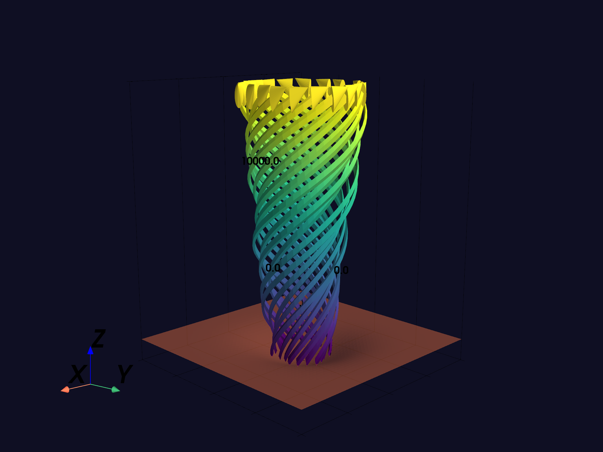

# skyvista

**3D gridded atmospheric data visualization in Python**

`skyvista` provides scientifically accurate 3D visualization of gridded atmospheric science data (but likely applicable in many other disciplines). Skyvista's visualizations are primarily built on top of the [pyvista](https://pyvista.org/#) library, and with the appropriate setup can be rendered directly in jupyter notebooks or IDEs, or written to disk. Pyvista is capable of creating interactive visualizations in pure HTML, making these visualizations conveniently portable. Skyvista also contains simplified functionality for creating animations of 3D data using pyvista, in addition to single visualizations.

<p align="center">
  
</p>

## Features

- **Gridded data visualization**: Create sets of isosurfaces, volumes, vectors, or planes (for things like land/ocean surfaces or cross-sections) from xarray datasets
- **Multiple coordinate systems**: Cartesian, geographic (lat/lon), spherical (radar range/azimuth/elevation), curvilinear, and unstructured grids with automatic detection
- **Trajectory visualization**: Visualize Lagrangian trajectory data, with options to show trajectories as continuous arrows or as particles at their instantaneous positions
- **Animation support**: Generate animations of time-evolving gridded atmospheric data
- **Camera control**: Advanced camera positioning and following for dynamic views
- **Interactive HTML export**: Export scenes to standalone interactive HTML files

<p align="center">
  <a href="assets/example_interactive.html">Interactive example (download and open in browser)</a>
</p>

## Installation

First install skyvista, which will install pyvista as a dependency:

```bash
pip install skyvista
```

From here, pyvista configuration may be complicated depending on your setup. We recommend following the [pyvista installation documentation](https://docs.pyvista.org/getting-started/installation.html) and ensuring that you can successfully create an interactive bunny visualization, following the documentation's example:

```python
from pyvista import examples
dataset = examples.download_bunny()
dataset.plot(cpos='xy')
```

## Quick Start

```python
import skyvista as sv
import xarray as xr

storm_ds = xr.open_dataset("model_output.nc")

scene = sv.Scene()
scene.add_contour(storm_ds, "W", isosurfaces=[1, 3, 5, 10], cmap="Greens", opacity=0.8)
scene.add_contour(storm_ds, "RC", cmap="Blues", opacity=0.4)
scene.show()
```

For a full walkthrough of the API (convenience functions, factory functions, and VarSpec classes), see the [API guide notebook](docs/API_guide.ipynb).

For examples of working with different coordinate systems (geographic, radar/spherical, curvilinear), see the [coordinate systems demo](examples/coordinate_systems_demo.ipynb).

## Data Format

Gridded data should be xarray `Dataset`s with dimensions `x`, `y`, `z`, and optionally `time` for animations. Skyvista auto-detects the coordinate system from coordinate names or CF convention attributes. See the [coordinate systems demo](examples/coordinate_systems_demo.ipynb) for details on supported formats.

## License

MIT License

## Citation

If you use skyvista in your research, please cite:

```bibtex
@software{skyvista,
  author = {Davis, Charles},
  title = {skyvista: 3D gridded atmospheric data visualization in Python},
  year = {2026},
  url = {https://github.com/cmdavis4/skyvista}
}
```
